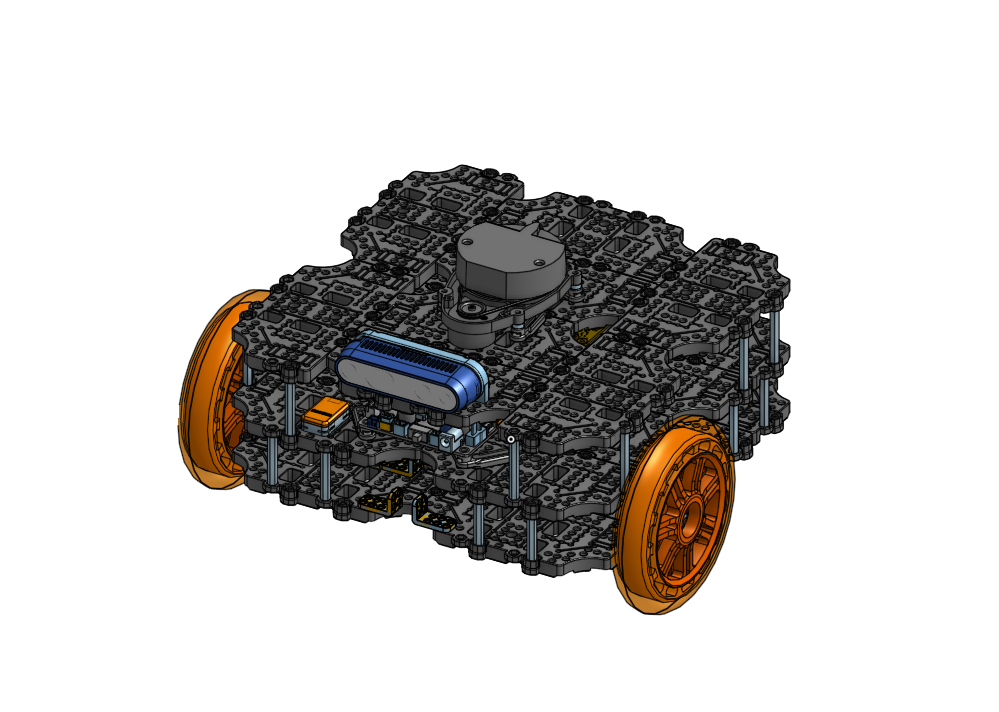
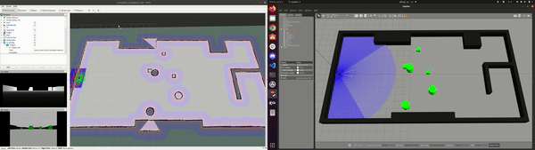
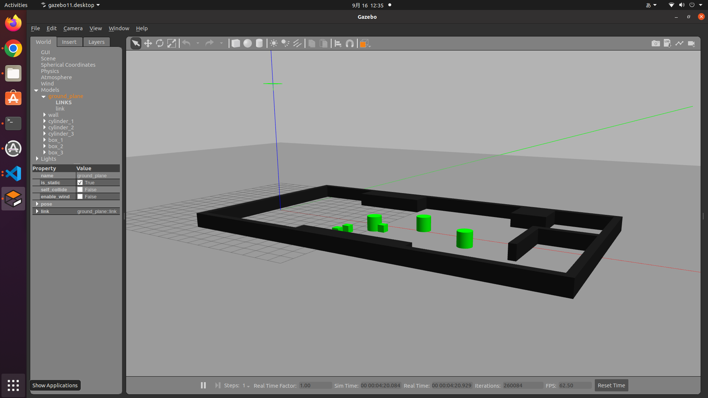
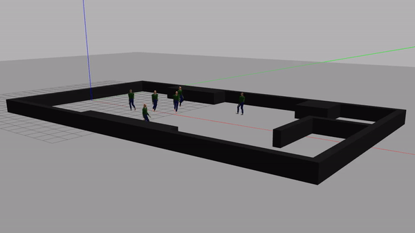
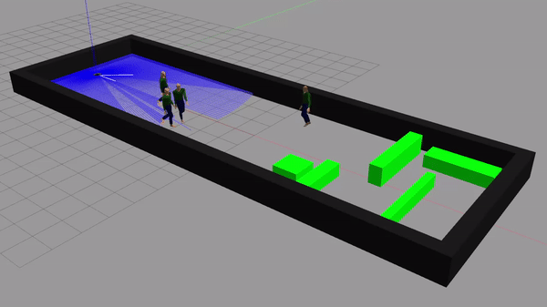

[日本語](./README_tb3_big_wheel_jp.md) | [English](./README_tb3_big_wheel_en.md)

# TurtleBot3 Friends: Big Wheel


## In Development Process

## Navigation Demo in real-world environment

| Real-world | Rviz |
|:---:|:---:|
|  |  | 

| Real-world | Rviz |
|:---:|:---:|
|  |  |

| 実環境 | Rviz |
|:---:|:---:|
|  |  |

## Navigation Demo in Gazebo environment

| Gazebo + Rviz | 
|:---:|
|  |


## Setup Manual（Quick Start Guide）
### 1. Environment Setup
Some modifications from the original TurtleBot3 are required in order to use and test the new Big Wheel model from the TurtleBot3 Friends family. To do so, please follow the official TurtleBot3 e-Manual 「[Quick Start Guide](https://emanual.robotis.com/docs/en/platform/turtlebot3/quick-start/)」. Please, take note of the following changes that are pointed out.

- About [1.1. PC Setup](https://emanual.robotis.com/docs/en/platform/turtlebot3/quick-start/#pc-setup)
Big Wheel model uses whether Raspberry Pi 4B or NUC11 as SBC. Right now, ROS Humble
is also in process of development. Please, select the 「Foxy」 branch from the 「[Quick Start Guide](https://emanual.robotis.com/docs/en/platform/turtlebot3/quick-start/)」, the Humble version is not yet supported officially.


- Changes in [1.1.2. Install ROS 2 on Remote PC](https://emanual.robotis.com/docs/en/platform/turtlebot3/quick-start/#install-ros-2-on-remote-pc)

Prepare your environment installing ROS Humble/

```code
$ wget https://raw.githubusercontent.com/ROBOTIS-JAPAN-GIT/robotis_tools_jp/master/install_ros2_humble.sh
$ sudo chmod 755 ./install_ros2_humble.sh
$ bash ./install_ros2_humble.sh
```

- Changes in [1.1.3. Install Dependent ROS Packages](https://emanual.robotis.com/docs/en/platform/turtlebot3/quick-start/#install-dependent-ros-2-packages)

Now install some required packages.

```code
$ sudo apt-get install ros-humble-gazebo-*

$ sudo apt install ros-humble-cartographer
$ sudo apt install ros-humble-cartographer-ros

$ sudo apt install ros-humble-navigation2
$ sudo apt install ros-humble-nav2-bringup
```

- Changes in [1.1.4. Install TurtleBot3 Packages](https://emanual.robotis.com/docs/en/platform/turtlebot3/quick-start/#install-turtlebot3-packages)

Once ROS Humble is already installed, we will install some required ROS packages from the ROBOTIS Japan official GitHub site for TurtleBot3. Please, introduce the following commands in your terminal.

```code
$ sudo apt remove ros-humble-dynamixel-sdk
$ sudo apt remove ros-humble-turtlebot3-msgs
$ sudo apt remove ros-humble-turtlebot3
# If a warning message appears saying that there is no such packages, you can ignore it

$ mkdir -p ~/turtlebot3_ws/src
$ cd ~/turtlebot3_ws/src/
$ git clone -b humble-devel https://github.com/ROBOTIS-GIT/DynamixelSDK.git
$ git clone -b humble-devel https://github.com/ROBOTIS-GIT/turtlebot3_msgs.git
$ git clone -b humble-jp-devel https://github.com/ROBOTIS-JAPAN-GIT/turtlebot3_jp_custom
$ cd ~/turtlebot3_ws
$ colcon build --symlink-install
$ echo 'source ~/turtlebot3_ws/install/setup.bash' >> ~/.bashrc
$ source ~/.bashrc
```

- Changes in [1.1.5. Environment Configuration](https://emanual.robotis.com/docs/en/platform/turtlebot3/quick-start/#environment-configuration)

Let's setup the ROS environemnt.
```code
$ echo 'export ROS_DOMAIN_ID=30 #TURTLEBOT3' >> ~/.bashrc
$ source ~/.bashrc
```

- About [3.2. SBC Setup](https://emanual.robotis.com/docs/en/platform/turtlebot3/sbc_setup/#sbc-setup)

In the new Big Wheel model, NUC11 is used as main processing computer, instead the Raspbery Pi 4B that has being used in `Buger` or `Waffle Pi` models. We will omit the usual SBC setup setup. Please follow the next steps in your NUC.

> **Warning**
> We did not conduct yet any experiments to confirm the correct movement in the actual robot. Please, follow the next instructions in your own responsability. Thank you!

> **Note**
> In the case you want to still use Raspberry Pi 4B, please follow those steps from the TurtleBot3 e-Manual.

1. Install Ubuntu 20.04.

2. Install ROS Humble.

3. Install TurtleBot3 required packages as it follows

```code
$ sudo apt remove ros-humble-dynamixel-sdk
$ sudo apt remove ros-humble-turtlebot3-msgs
$ sudo apt remove ros-humble-turtlebot3
# If a warning message appears saying that there is no such packages, you can ignore it

$ mkdir -p ~/turtlebot3_ws/src
$ cd ~/turtlebot3_ws/src/
$ git clone -b humble-devel https://github.com/ROBOTIS-GIT/DynamixelSDK.git
$ git clone -b humble-devel https://github.com/ROBOTIS-GIT/turtlebot3_msgs.git
$ git clone -b humble-jp-devel https://github.com/ROBOTIS-JAPAN-GIT/turtlebot3_jp_custom
$ cd ~/turtlebot3_ws
$ colcon build --symlink-install
$ echo 'source ~/turtlebot3_ws/install/setup.bash' >> ~/.bashrc
$ source ~/.bashrc
```

- Changes in [3.3. OpenCR Setup](https://emanual.robotis.com/docs/en/platform/turtlebot3/opencr_setup)

The setup of the OpenCR is done through the NUC.

1. Connect the [OpenCR](https://emanual.robotis.com/docs/en/parts/controller/opencr10/) to te NUC through a micro USB cable.

2. Skip the installation of arm Debian packages (in NUC are not required).

3. Select ```big_wheel_noetic``` as the `OPENCR_MODEL`.
```code
$ export OPENCR_PORT=/dev/ttyACM0
$ export OPENCR_MODEL=big_wheel_humble
$ rm -rf ./opencr_update.tar.bz2
```

4. Download the firmware and uncompress it. (ToDo)
```code
$ wget https://github.com/ROBOTIS-JAPAN-GIT/OpenCR_jp_custom/releases/download/v1.0.0/opencr_update_jp_custom.tar.bz2
$ tar -xvf opencr_update_jp_custom.tar.bz2 
```

5. Burn the firmware into the OpenCR.
```code
$ cd ./opencr_update
$ ./update.sh $OPENCR_PORT $OPENCR_MODEL.opencr
```

6. If the firmware for the TurtleBot3 Big Wheel has been successfully burnt into the OpenCR, the following message will appear. (This is just an image)


### 4. Additional packages setup
In the new TurtleBot3 Big Wheel model, 「Realsense D435」 is used as defaut camera and 「LDS-series」 as default LiDAR sensor. Here, we will explain about its setup.

> **Warning**
> The following steps are conducted in the `remote PC`.

1. **Camera setup**

First of all, please install the requiered packages.
- ROS Wrapper for Intel® RealSense™ Devices (Based on official website)

```code
$ sudo apt-get install ros-$ROS_DISTRO-realsense2-camera
$ cd ~/turtlebot3_ws/src
$ git clone -b humble-jp-devel https://github.com/ROBOTIS-JAPAN-GIT/realsense-ros_jp_custom
$ cd ~/turtlebot3_ws
$ colcon build --symlink-install
```

> **Note**
> If you want to know more in detail about the [realsense-ros](https://github.com/IntelRealSense/realsense-ros), please refer to the official GitHub repository.


1. **LiDAR setup**

In the case of TurtleBot3 Big Wheel as default, we use the same sensor provided in the original TurtleBot3. You can decide t use whether the LDS-01 or the LDS-02. In that case, please refere to the TurtleBot3 e-Manual to complete the setup
[3.2.8. NEW LDS-02 Configuration](https://emanual.robotis.com/docs/en/platform/turtlebot3/sbc_setup/)

## Simulation Environment（Gazebo）
TurtleBot3 Big Wheel counts with Gazebo support, a simulation environment which takes into account the physics of its virtual environmet. By just dowloading the following package, you will be able to use it with no problem.

```code
$ cd ~/turtlebot3_ws/src/
$ git clone -b humble-jp-devel https://github.com/ROBOTIS-JAPAN-GIT/turtlebot3_simulations_jp_custom
$ git clone https://github.com/robotics-upo/lightsfm
$ cd lightsfm
$ make
$ sudo make install
$ cd ~/turtlebot3_ws
$ colcon build --symlink-install
```


## Let's move it!

### Real robot
Congratulations! You have been able to setup your developing environment. Now, let's move the TurtleBot3 Big Wheel. To do so, please followg the next steps.

> **Warning**
> We did not conduct yet any experiments to confirm the correct movement in the actual robot. Please, follow the next instructions in your own responsability. Thank you!

0. Select the TurtleBot3 model.
```code 
$ export TURTLEBOT3_MODEL=big_wheel
```

You can also add it to the last of the [~/.bashrc] file.
```code 
export TURTLEBOT3_MODEL=big_wheel
```

> **Note**
> Everytime you open a new terminal, it is required to select the TurtleBot3 model, you would use. A part from `big_wheel`, you can slo try other models such as `burger`, `waffle_pi`, `pizza`.

1. Connect to  **NUC**.
```code
$ ssh ubuntu@{IP_ADDRESS_OF_RASPBERRY_PI}
```
2. In the **NUC**, launch the Turtlebot3 Big Wheel.
```code
$ ros2 launch turtlebot3_bringup robot.launch.py
```
3. If required, in the **remote PC** launch the TeleOperation.
```code
$ ros2 run turtlebot3_teleop teleop_keyboard
```

- **SLAM (mapping) + Navigation**

In other to use those packages, please refer to the official e-Manual 「[SLAM](https://emanual.robotis.com/docs/en/platform/turtlebot3/slam/)」 and 「[Navigation](https://emanual.robotis.com/docs/en/platform/turtlebot3/navigation/)」. The bring-up steps are the same as previous models.


### Simulation
In other to use the Gazebo simulation environment, please refer to the official e-Manual「[1.1.2. Launch Simulation World](https://emanual.robotis.com/docs/en/platform/turtlebot3/simulation/#launch-simulation-world)」. The bring-up stes are the same as previous models.

```code 
$ export TURTLEBOT3_MODEL=big_wheel
$ ros2 launch turtlebot3_gazebo empty_world.launch.py
```

> **Note**
> A part from `empty_world`, you can also try different environments such as `house`, `simulation`, `stage_1`. Moreover, as ROBOTIS Japan, we have prepared a few new environments. Right now, we have `turtlebot3_jp_world_empty`, `turtlebot3_jp_world_static`, `turtlebot3_jp_world_dynamic`, `turtlebot3_jp_world_corridor_pedestrian` 4 different worlds ready to use.

(This is just an image)
| World Name | Image |
|:---:|:---:|
| turtlebot3_jp_world_static |  | 
| turtlebot3_jp_world_dynamic |  |
| turtlebot3_jp_world_corridor_pedestrian |  |
| turtlebot3_jp_world_corridor_pedestrian (rgbd) |  |

## Hardware Related
### Bill Of Materials（BOM）
| Item | Reference no. | Quantity | Link |
|---|---|---|---|
| TurtleBot3 Waffle Pi | --- | 1 | [here](https://e-shop.robotis.co.jp/product.php?id=351) |
| NUC 11 Pro Kit NUC11TNHv7 | BNUC11TNHV70000 | 1 | [here](https://www.ark-pc.co.jp/i/31400996/) |
| Realsense d435 | --- | 1 | [here](https://www.intelrealsense.com/depth-camera-d435/) |
| Wheel (5inch) | --- | 2 | [here]() |
| --- | --- | --- | [here]() |


### 3D Model Reference
If you want to know more in detail about the 3D model parts, please have a look in the  [Turtlebot3 Friends: Big Wheel](https://cad.onshape.com/documents/7daf195495224735934e7007/w/169d3bbd6522bfb5c32193c2/e/39cd43d7a31a1c83661df9da?renderMode=0&uiState=63156a1b6310686ce43b53e0) OnShape document.


### Model Characteristics
| Items | Pizza | Big Wheel |
|---|---|---|
| Maximum translational velocity | 0.35 m/s | 0.50 m/s |
| Maximum rotational velocity | 1.49 rad/s | 3.41 rad/s |
| Maximum payload | ? | 30kg |
| Size (L x W x H) | 434.94mm x 489.10mm x 261.54mm | 281mm x 306mm x 170.30mm |
| Weight |  |  |
| Threshold of climbing |  |  |
| Expected operating time |  |  |
| Expected charging time |  |  |
| Cumputer | NUC10i7FNHN | Raspberry Pi |
| MCP |  Intel® Core™ i7-10710U Processor (12M Cache, up to 4.70 GHz)  | 32-bit ARM Cortex®-M7 with FPU (216 MHz, 462 DMIPS) |
| Remote Controller | - | - |
| Actuator | XM540-W150 | XM430-W210 |
| LiDAR | SICK TiM571 | 360 Laser Distance Sensor LDS-01 or LDS-02 |
| Camera | Realsense D435 | Realsense D435 |
| IMU | GyroscSeveral programmable beep sequencesope 3 Axis | Gyroscope 3 Axis |
|     | Accelerometer 3 Axis | Accelerometer 3 Axis |
| Power connectors |  | 3.3V / 800mA, 5V / 4A, 12V / 1A |
| Expansion pins |  | GPIO 18 pins, Arduino 32 pin |
| Peripheral |  | UART x3, CAN x1, SPI x1, I2C x1, ADC x5, 5pin OLLO x4 |
| DYNAMIXEL ports | RS485 x 3, TTL x 3 | RS485 x 3, TTL x 3 |
| Audio | Several programmable beep sequences | Several programmable beep sequences |
| Programmable LEDs | User LED x 4 | User LED x 4 |
| Status LEDs | Board status LED x 1, Arduino LED x 1, Power LED x 1 | Board status LED x 1, Arduino LED x 1, Power LED x 1 |
| Buttons and Switches | Push buttons x 2, Reset button x 1, Dip switch x 2 | Push buttons x 2, Reset button x 1, Dip switch x 2 |
| Battery | マキタ互換バッテリー BL1490 14.4v 9Ah | Lithium polymer 11.1V 1800mAh / 19.98Wh 5C |
| PC connection | USB | USB |
| Firmware upgrade | via USB, via JTAG | via USB, via JTAG |
| Power adapter (SMPS) | Input : 100-240V, AC 50/60Hz, 1.5A @max, Output : 12V DC, 5A | Input : 100-240V, AC 50/60Hz, 1.5A @max, Output : 12V DC, 5A |


## ROBOTIS e-Manual for TurtleBot3
- [ROBOTIS e-Manual for TurtleBot3](http://turtlebot3.robotis.com/)

## Open Source related to TurtleBot3
- [turtlebot3](https://github.com/ROBOTIS-GIT/turtlebot3)
- [turtlebot3_jp_custom](https://github.com/ROBOTIS-JAPAN-GIT/turtlebot3_jp_custom)
- [turtlebot3_msgs](https://github.com/ROBOTIS-GIT/turtlebot3_msgs)
- [turtlebot3_simulations](https://github.com/ROBOTIS-GIT/turtlebot3_simulations)
- [turtlebot3_simulations_jp_custom](https://github.com/ROBOTIS-JAPAN-GIT/turtlebot3_simulations_jp_custom)
- [dynamixel_sdk](https://github.com/ROBOTIS-GIT/DynamixelSDK)
- [OpenCR-Hardware](https://github.com/ROBOTIS-GIT/OpenCR-Hardware)
- [OpenCR](https://github.com/ROBOTIS-GIT/OpenCR)

## Documents and Videos related to TurtleBot3
- [ROBOTIS e-Manual for TurtleBot3](http://turtlebot3.robotis.com/)
- [ROBOTIS e-Manual for Dynamixel SDK](http://emanual.robotis.com/docs/en/software/dynamixel/dynamixel_sdk/overview/)
- [Website for TurtleBot Series](http://www.turtlebot.com/)
- [e-Book for TurtleBot3](https://community.robotsource.org/t/download-the-ros-robot-programming-book-for-free/51/)
- [Videos for TurtleBot3](https://www.youtube.com/playlist?list=PLRG6WP3c31_XI3wlvHlx2Mp8BYqgqDURU)
