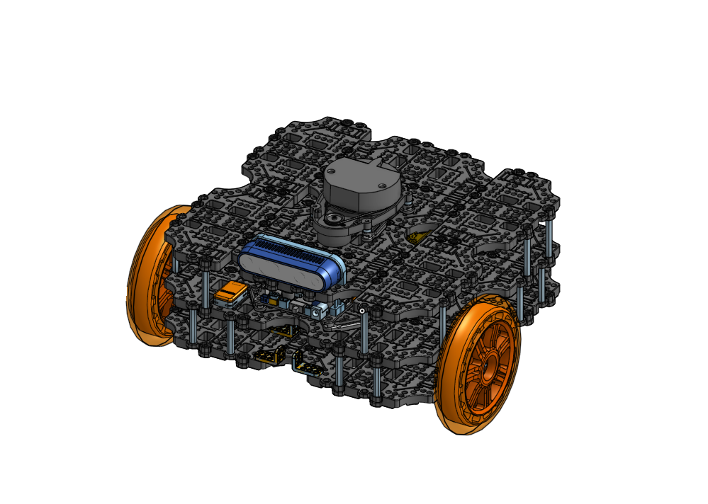
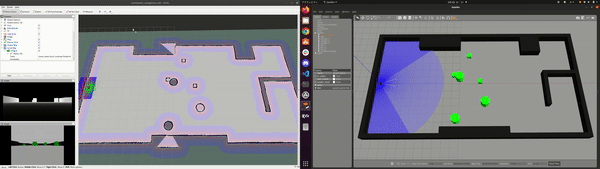
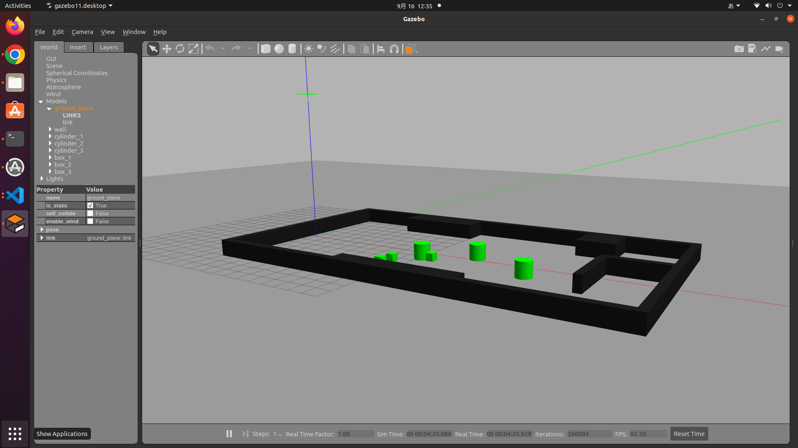
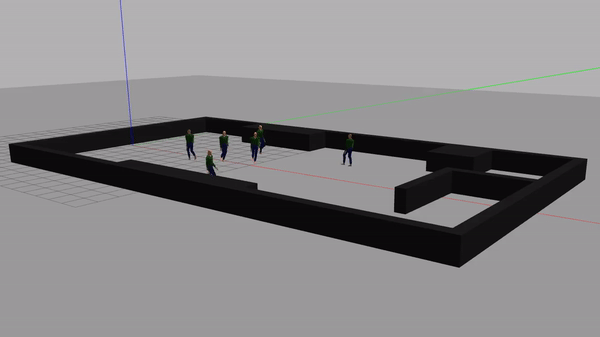
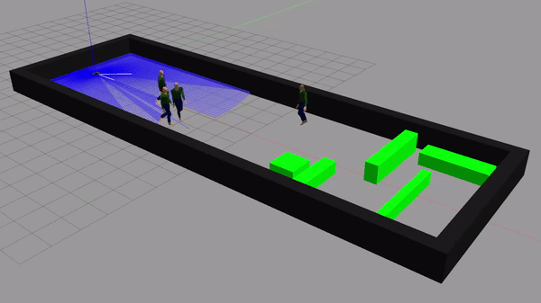

[日本語](./README_tb3_big_wheel_jp.md) | [English](/turtlebot3/documentation/README_tb3_big_wheel_en.md)

# TurtleBot3 Friends: Big Wheel


## 実環境での動作検証

| 実環境 | Rviz |
|:---:|:---:|
|  |  | 

| 実環境 | Rviz |
|:---:|:---:|
|  |  |

|実環境 | Rviz |
|:---:|:---:|
|  |  |

## Gazebo環境での動作検証

| Gazebo環境 + Rviz | 
|:---:|
|  |


## セットアップ手順（Quick Start Guide）
### 1. 環境設定
Turtlebot3の新FriendsモデルのBig Wheelを利用するには、まずTurtlebot3の基本的な設定を行う必要があります。そのため、TurtleBot3のe-Manualの「[Quick Start Guide](https://emanual.robotis.com/docs/en/platform/turtlebot3/quick-start/)」に従って、セットアップを行ってください。ただし、以下の変更点にご注意ください。

- [1.1. PC Setup](https://emanual.robotis.com/docs/en/platform/turtlebot3/quick-start/#pc-setup)について

Big WheelモデルではSBCとして、Raspberry Pi 4BもしくはNUC11を使います。現時点で、ROS Humbleへの対応を行っていますが、「[Quick Start Guide](https://emanual.robotis.com/docs/en/platform/turtlebot3/quick-start/)」の`Foxy`ブランチを選択してください。

> **Warning**
> 公式的に、`Humble`のバージョンが公開されていませんので、ご参考までお願いします。

- [1.1.2. Install ROS 2 on Remote PC](https://emanual.robotis.com/docs/en/platform/turtlebot3/quick-start/#install-ros-2-on-remote-pc)の変更点

ROBOTIS日本支店としてのROS 2インストールスクリプトファイルと実行します。

```code
$ wget https://raw.githubusercontent.com/ROBOTIS-JAPAN-GIT/robotis_tools_jp/master/install_ros2_humble.sh
$ sudo chmod 755 ./install_ros2_humble.sh
$ bash ./install_ros2_humble.sh
```

- [1.1.3. Install Dependent ROS Packages](https://emanual.robotis.com/docs/en/platform/turtlebot3/quick-start/#install-dependent-ros-2-packages)の変更点

必要なROSパッケージをインストールします。

```code
$ sudo apt-get install ros-humble-gazebo-*

$ sudo apt install ros-humble-cartographer
$ sudo apt install ros-humble-cartographer-ros

$ sudo apt install ros-humble-navigation2
$ sudo apt install ros-humble-nav2-bringup
```

- [1.1.4. Install TurtleBot3 Packages](https://emanual.robotis.com/docs/en/platform/turtlebot3/quick-start/#install-turtlebot3-packages)の変更点

この部分では必要なROSパッケージをインストールしますが、今回はDebianのバイナリーパッケージのではなく、ROBOTIS日本支店の公式GitHubからダウンロードします。以下の手順通りセットアップを進めてください。

```code
$ sudo apt remove ros-humble-dynamixel-sdk
$ sudo apt remove ros-humble-turtlebot3-msgs
$ sudo apt remove ros-humble-turtlebot3
# 上記のパッケージがないとのメッセージが表示される場合、無視しても大丈夫です

$ mkdir -p ~/turtlebot3_ws/src
$ cd ~/turtlebot3_ws/src/
$ git clone -b humble-devel https://github.com/ROBOTIS-GIT/DynamixelSDK.git
$ git clone -b humble-devel https://github.com/ROBOTIS-GIT/turtlebot3_msgs.git
$ git clone -b humble-jp-devel https://github.com/ROBOTIS-JAPAN-GIT/turtlebot3_jp_custom
$ cd ~/turtlebot3_ws
$ colcon build --symlink-install
$ echo 'source ~/turtlebot3_ws/install/setup.bash' >> ~/.bashrc
$ source ~/.bashrc
```

- [1.1.5. Environment Configuration](https://emanual.robotis.com/docs/en/platform/turtlebot3/quick-start/#environment-configuration)の変更点

次のようにROSの環境をご設定ください。
```code
$ echo 'export ROS_DOMAIN_ID=30 #TURTLEBOT3' >> ~/.bashrc
$ source ~/.bashrc
```

- [3.2. SBC Setup](https://emanual.robotis.com/docs/en/platform/turtlebot3/sbc_setup/#sbc-setup)について

NUC11をBig WheelのSBCとして使う場合には、e-Manualに記載されているセットアップ手順は実行せずに、次のような手順でセットアップを行います。

> **Warning**
> 実機での動作確認はまだされていませんので、自己責任でご参考ください。まだ検証中です。

> **Note**
> Raspberry Pi 4Bを用いる場合は、e-Manualを参考に通常のTurtleBot3と同様のセットアップ手順によりネットワークを設定してください。

1. NUCにUbuntu 22.04をインストールします。

2. ROS Humbleをインストールします。

3. Turtlebot3の必要なパッケージをインストールします。

```code
$ sudo apt remove ros-humble-dynamixel-sdk
$ sudo apt remove ros-humble-turtlebot3-msgs
$ sudo apt remove ros-humble-turtlebot3
# 上記のパッケージがないメッセージが表示される場合、無視しても大丈夫です

$ mkdir -p ~/turtlebot3_ws/src
$ cd ~/turtlebot3_ws/src/
$ git clone -b humble-devel https://github.com/ROBOTIS-GIT/DynamixelSDK.git
$ git clone -b humble-devel https://github.com/ROBOTIS-GIT/turtlebot3_msgs.git
$ git clone -b humble-jp-devel https://github.com/ROBOTIS-JAPAN-GIT/turtlebot3_jp_custom
$ cd ~/turtlebot3_ws
$ colcon build --symlink-install
$ echo 'source ~/turtlebot3_ws/install/setup.bash' >> ~/.bashrc
$ source ~/.bashrc
```

- [3.3. OpenCR Setup](https://emanual.robotis.com/docs/en/platform/turtlebot3/opencr_setup)の変更点

OpenCRを設定するには、Raspberry Pi 4BもしくはNUC11（使用しているSBC）を通して、セットアップを行います。

1. [OpenCR](https://emanual.robotis.com/docs/en/parts/controller/opencr10/)をmicro USBケーブル経由でNUC11に繋げてください。

2. OpenCRにファームウェアをアップロードするために必要なDebianパッケージをRaspberry Pi 4Bへインストールします。NUCの場合は不要です。
```code
$ sudo dpkg --add-architecture armhf
$ sudo apt-get update
$ sudo apt-get install libc6:armhf
```

3. OPENCR_MODELに```big_wheel```と書きます。
```code
$ export OPENCR_PORT=/dev/ttyACM0
$ export OPENCR_MODEL=big_wheel_humble
$ rm -rf ./opencr_update.tar.bz2
```

4. ファームウェアをダウンロードして、解凍します。`TODO`
```code
$ wget wget https://github.com/ROBOTIS-JAPAN-GIT/OpenCR_jp_custom/releases/download/ros2v1.0.0/opencr_update_jp_custom.tar.bz2
$ tar -xvf opencr_update_jp_custom.tar.bz2 
```

5. OpenCRにファームウェアをアップロードします。
```code
$ cd ./opencr_update
$ ./update.sh $OPENCR_PORT $OPENCR_MODEL.opencr
```

6. Turtlebot3 Big Wheelのファームウェアが正しくアップロードされたら、以下のようなメッセージが出力されます。(イメージ図)


### 2. 追加レポジトリの設定
Turtlebot3のBig Wheelモデルには、デフォルトとして「Realsense D435」のデプスカメラが搭載されています。ここでは、レポジトリのセットアップ手順を説明します。
> **Warning**
> 以下の手順はリモートPC側に行われます。

1. **カメラ設定**

まず、必要なパッケージをインストールします。
- ROS Wrapper for Intel® RealSense™ Devices（公式サイトより）
```code
$ sudo apt-get install ros-$ROS_DISTRO-realsense2-camera
$ cd ~/turtlebot3_ws/src
$ git clone -b humble-jp-devel https://github.com/ROBOTIS-JAPAN-GIT/realsense-ros_jp_custom
$ git clone -b foxy-devel https://github.com/pal-robotics/realsense_gazebo_plugin
$ cd ~/turtlebot3_ws
$ colcon build --symlink-install
```
> **Note**
> [realsense-ros](https://github.com/IntelRealSense/realsense-ros)の設定手順のついて詳しく公式のGitHubに参照してください。

> **Note**
> RealSenseの対応を確認したい方は[Intel RealSense Gazebo ROS plugin](https://github.com/pal-robotics/realsense_gazebo_plugin)を参考ください。


1. **LiDAR設定**

TurtleBot3 Big Wheelでは、通常のTurtleBot3と同じくLDS-01もしくはLDS-02を使用します。そのため、e-Manualと同様の手順でセットアップを行ってください。
[3.2.8. NEW LDS-02 Configuration](https://emanual.robotis.com/docs/en/platform/turtlebot3/sbc_setup/)

## シミュレーション環境（Gazebo）
TurtleBot3 Big WheelにはGazeboという物理演算を考慮したシミュレーション環境も備えています。基本的に、シミュレーションのパッケージをダウンロードするだけで、すぐに使うことができます。

```code
$ cd ~/turtlebot3_ws/src/
$ git clone -b humble-jp-devel https://github.com/ROBOTIS-JAPAN-GIT/turtlebot3_simulations_jp_custom
$ git clone https://github.com/robotics-upo/lightsfm
$ cd lightsfm
$ make
$ sudo make install
$ cd ~/turtlebot3_ws
$ colcon build --symlink-install
```


## 動かしてみましょう！

### 実機
この時点に付いたら、環境のセットアップは完了となります。これから、Turtlebot3 Big Wheelモデルを実際に動かしてみましょう。動作方法は、e-Manualの「[Bring-Up](https://emanual.robotis.com/docs/en/platform/turtlebot3/bringup/)」のままで進めば大丈夫です。

> **Warning**
> 実機での動作確認はまだされていません。自己責任でご参考ください。まだ検証中です。


そして、新しいターミナルを開くたびに、Turtlebot3のモデルも指定してください。
```code 
$ export TURTLEBOT3_MODEL=big_wheel
```
もしくは、[~/.bashrc]のファイルの最後に追加してください。
```code 
export TURTLEBOT3_MODEL=big_wheel
```

> **Note**
> 新しい端末をたちが得るたびに、以上のコマンドを実行する必要があります。そして、`big_wheel`以外にも、`burger`, `waffle_pi`, `pizza`というモデルもあります。

1. まず**NUC側**と繋ぎます。
```code
$ ssh ubuntu@{IP_ADDRESS_OF_RASPBERRY_PI}
```
2. **NUC側**でTurtlebot3 Big Wheelのbringupコマンドを実行します。
```code
$ ros2 launch turtlebot3_bringup robot.launch.py
```
3. 必要であれば、**リモートPC側**でTeleOPを実行します。
```code
$ ros2 run turtlebot3_teleop teleop_keyboard
```

- **SLAM (地図生成) + Navigation**

通常のTurtleBot3と同じ手順で実行できますので、公式のe-Manualの「[SLAM](https://emanual.robotis.com/docs/en/platform/turtlebot3/slam/)」や「[Navigation](https://emanual.robotis.com/docs/en/platform/turtlebot3/navigation/)」に従って進めてください。


### シミュレーション
動作方法は、e-Manualの「[1.1.2. Launch Simulation World](https://emanual.robotis.com/docs/en/platform/turtlebot3/simulation/#launch-simulation-world)」の項目ままで進めば大丈夫です。


```code 
$ export TURTLEBOT3_MODEL=big_wheel
$ ros2 launch turtlebot3_gazebo empty_world.launch.py
```
> **Note**
> `empty_world`以外にも、`house`, `simulation`, `stage_1`などという環境もあります。そして、ROBOTIS日本支店カスタムのワールドもあります。現時点では、`turtlebot3_jp_world_empty`, `turtlebot3_jp_world_static`, `turtlebot3_jp_world_dynamic`, `turtlebot3_jp_world_corridor_pedestrian`の4種類のワールドを用意しています。

（イメージ図）
| モデル名 | 画像 |
|:---:|:---:|
| turtlebot3_jp_world_static |  | 
| turtlebot3_jp_world_dynamic |  |
| turtlebot3_jp_world_corridor_pedestrian |  |
| turtlebot3_jp_world_corridor_pedestrian (rgbd) |  |


## ハードウェア関係
### 部品リスト（BOM）

| 部品名 | 型番 | 個数 | 購入リンク |
|---|---|---|---|
| TurtleBot3 Waffle Pi | --- | 1 | [here](https://e-shop.robotis.co.jp/product.php?id=351) |
| NUC 11 Pro Kit NUC11TNHv7 | BNUC11TNHV70000 | 1 | [here](https://www.ark-pc.co.jp/i/31400996/) |
| Realsense d435 | --- | 1 | [here](https://www.intelrealsense.com/depth-camera-d435/) |
| 車輪(5inch) | --- | 2 | [here]() |
| --- | --- | --- | [here]() |


### 3Dモデルの参照
詳細なパーツのリストとモデルの設計は、[Turtlebot3 Friends: Big Wheel](https://cad.onshape.com/documents/7daf195495224735934e7007/w/169d3bbd6522bfb5c32193c2/e/39cd43d7a31a1c83661df9da?renderMode=0&uiState=63156a1b6310686ce43b53e0)のOnShapeドキュメントで確認できます。

### モデルの特徴
| 項目 | Pizza | Big Wheel |
|---|---|---|
| 最大直進速度 | 0.35 m/s | 0.50 m/s |
| 最大回転速度 | 1.49 rad/s | 3.41 rad/s |
| 最大ペイロード |  | 30kg |
| サイズ（長さ x 幅 x 高さ） | 434.94mm x 489.10mm x 261.54mm | 281mm x 306mm x 170.30mm |
| 重量 |  |  |
| 乗り上げ可能高さ |  |  |
| 動作時間 |  |  |
| 充電時間 |  |  |
| コンピュータ | NUC10i7FNHN | Raspberry Pi |
| MCP |  Intel® Core™ i7-10710U Processor (12M Cache, up to 4.70 GHz)  | 32-bit ARM Cortex®-M7 with FPU (216 MHz, 462 DMIPS) |
| リモートコントローラ | - | - |
| アクチュエータ | XM540-W150 | XM430-W210 |
| LiDAR | SICK TiM571 | 360 Laser Distance Sensor LDS-01 or LDS-02 |
| カメラ | Realsense D435 | Realsense D435 |
| IMU | Gyroscope 3 Axis | Gyroscope 3 Axis |
|     | Accelerometer 3 Axis | Accelerometer 3 Axis |
| 供給入力端子 |  | 3.3V / 800mA, 5V / 4A, 12V / 1A |
| I/Oピン |  | GPIO 18 pins, Arduino 32 pin |
| 周辺機器 |  | UART x3, CAN x1, SPI x1, I2C x1, ADC x5, 5pin OLLO x4 |
| DINAMIXELポート | RS485 x 3, TTL x 3 | RS485 x 3, TTL x 3 |
| オーディオ | 複数ブザービート使用可能 | 複数ブザービート使用可能 |
| LED使用可能 | User LED x 4 | User LED x 4 |
| LEDステータス | Board status LED x 1, Arduino LED x 1, Power LED x 1 | Board status LED x 1, Arduino LED x 1, Power LED x 1 |
| ボタンとスイッチ | Push buttons x 2, Reset button x 1, Dip switch x 2 | Push buttons x 2, Reset button x 1, Dip switch x 2 |
| バッテリ | マキタ互換バッテリー BL1490 14.4v 9Ah | Lithium polymer 11.1V 1800mAh / 19.98Wh 5C |
| PC接続 | USB | USB |
| ファームウェア更新 | USB経由, JTAG経由 | USB経由, JTAG経由 |
| 電力アダプタ | Input : 100-240V, AC 50/60Hz, 1.5A @max, Output : 12V DC, 5A | Input : 100-240V, AC 50/60Hz, 1.5A @max, Output : 12V DC, 5A |


## TurtleBot3のROBOTIS e-Manual 
- [ROBOTIS e-Manual for TurtleBot3](http://turtlebot3.robotis.com/)

## TurtleBot3に関するオープンソース関連 
- [turtlebot3](https://github.com/ROBOTIS-GIT/turtlebot3)
- [turtlebot3_jp_custom](https://github.com/ROBOTIS-JAPAN-GIT/turtlebot3_jp_custom)
- [turtlebot3_msgs](https://github.com/ROBOTIS-GIT/turtlebot3_msgs)
- [turtlebot3_simulations](https://github.com/ROBOTIS-GIT/turtlebot3_simulations)
- [turtlebot3_simulations_jp_custom](https://github.com/ROBOTIS-JAPAN-GIT/turtlebot3_simulations_jp_custom)
- [dynamixel_sdk](https://github.com/ROBOTIS-GIT/DynamixelSDK)
- [OpenCR-Hardware](https://github.com/ROBOTIS-GIT/OpenCR-Hardware)
- [OpenCR](https://github.com/ROBOTIS-GIT/OpenCR)

## TurtleBot3に関するドキュメントと動画 
- [ROBOTIS e-Manual for TurtleBot3](http://turtlebot3.robotis.com/)
- [ROBOTIS e-Manual for Dynamixel SDK](http://emanual.robotis.com/docs/en/software/dynamixel/dynamixel_sdk/overview/)
- [Website for TurtleBot Series](http://www.turtlebot.com/)
- [e-Book for TurtleBot3](https://community.robotsource.org/t/download-the-ros-robot-programming-book-for-free/51/)
- [Videos for TurtleBot3](https://www.youtube.com/playlist?list=PLRG6WP3c31_XI3wlvHlx2Mp8BYqgqDURU)
